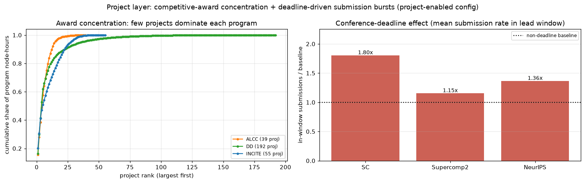
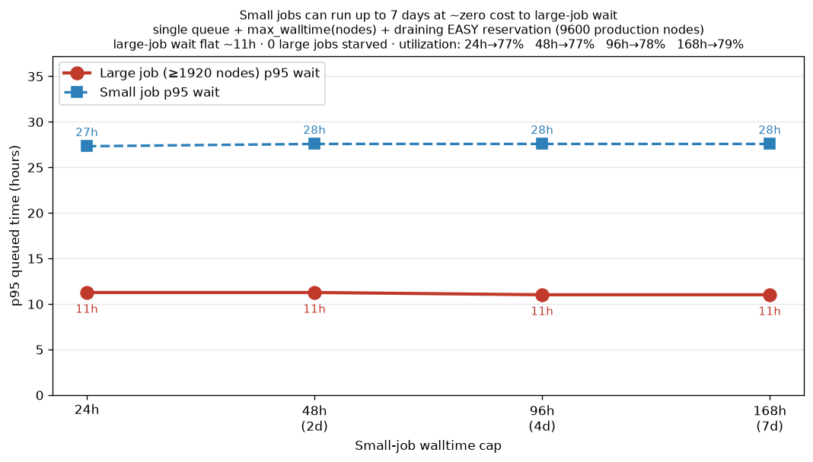

# MODELING.md — How jobs are modeled and sampled

**Purpose.** This document explains exactly how the simulator models the four
allocation programs — **INCITE, ALCC, Discretionary (DD)**, and the new
**Genesis Mission** — so that a reader can understand and challenge every
distribution being sampled and every allocation fraction being assumed. Nothing
here is a black box: for the three historical programs the numbers below are
measured directly from the Aurora PBS trace; for Genesis (which has no history)
every number is a stated assumption with its rationale.

**Data source.** All historical figures come from `pbs_monitor_aurora.db`, table
`jobs`, filtered to `state='FINISHED' AND nodes>0 AND actual_runtime_seconds>=30
AND submit_time IS NOT NULL`, with `allocation_type` mapped
`Discretionary→DD`, `UNKNOWN` dropped.

- Rows after filtering: **414,046**
- Trace span: **2025-06-12 → 2026-06-04 (357 days)**

Regenerate every table/figure in this document with:
```bash
python -c "from generator import load_trace; from config import SimConfig; \
  df=load_trace(SimConfig.from_yaml('configs/validate_baseline.yaml')); \
  print(len(df))"
```
(See "Inspecting the distributions yourself" at the end for the full commands.)
All figures in this document are regenerated by
[`scripts/make_modeling_figures.py`](scripts/make_modeling_figures.py):

```bash
python scripts/make_modeling_figures.py   # writes docs/figures/*.png
```


*Node-count, walltime, and runtime cumulative distributions (CDFs) for the three
historical programs — these are exactly the empirical distributions the joint
sampler draws from. Note DD's steep node CDF (its 1-node spike: p50 = 1 node),
INCITE's high job volume, and ALCC's longer walltimes.*

---

## 1. The core idea: joint bootstrap, not parametric fits

The simulator does **not** fit parametric distributions (log-normal, etc.) to
node counts and walltimes and then sample them independently. That approach
destroys the correlation between a job's size and its duration (e.g. big jobs
tend to run shorter because of walltime caps; 1-node jobs are often long AI
runs).

Instead it uses a **joint conditional bootstrap**: it resamples *whole real
job rows* — the tuple `(nodes, walltime, runtime)` kept together — from the
historical trace, drawn from a cell conditioned on:

```
(program, alloc_month_offset, size_tier)
```

- **program** — INCITE / ALCC / DD (the primary axis; see §6 for why project is
  deliberately excluded for now).
- **alloc_month_offset** — months since *that program's own* allocation-year
  start (0–11). This is what makes calendar behavior intrinsic (§4).
- **size_tier** — the node-count band (capacity/small/medium/large) the row
  falls in, so the cell mix reflects the real size profile within that season.

**What a joint draw looks like** (5 real draws from INCITE, alloc-offset 0):

| nodes | walltime (h) | runtime (h) |
|------:|-------------:|------------:|
| 1     | 0.17         | 0.05        |
| 90    | 2.83         | 0.54        |
| 1     | 1.00         | 0.05        |
| 100   | 0.50         | 0.18        |
| 15    | 6.00         | 5.00        |

Each row is a genuine historical job; the size↔duration relationship is
preserved because we never break the tuple apart.

**Fallback for sparse cells.** If a conditioning cell has fewer than
`generator.min_cell_rows` (default 20) real jobs, the sampler falls back to the
program-wide pool so we never bootstrap from a handful of outliers. Cell sizes
are large in practice — e.g. INCITE's biggest cells:

| program | alloc_offset | size_tier | rows |
|---------|-------------:|-----------|-----:|
| INCITE  | 7            | capacity  | 26,979 |
| INCITE  | 9            | capacity  | 16,751 |
| INCITE  | 0            | capacity  | 13,376 |

Code: `generator.ConditionalSampler`.

---

## 2. Per-program empirical summary (measured from the trace)

| Program | Jobs | Node-hours | **Delivered share** | Arrivals/day | rt/wt ratio (mean) |
|---------|-----:|-----------:|--------------------:|-------------:|-------------------:|
| INCITE  | 142,435 | 38.86 M | **57.0 %** | 399.0 | 0.303 |
| DD      | 230,071 | 20.32 M | **29.8 %** | 644.5 | 0.448 |
| ALCC    | 41,540  | 8.98 M  | **13.2 %** | 116.4 | 0.466 |

"Delivered share" = that program's node-hours ÷ total node-hours across the
three programs. **These are the empirical shares the simulator is validated
against** (see README_v2 — the full-year blind run reproduces ≈49.6/35.6/14.8,
with ALCC filling in over its allocation year).

### Node-count profile (nodes per job)

| Program | mean | p50 | p90 | p99 | max | character |
|---------|-----:|----:|----:|----:|----:|-----------|
| INCITE  | 110.8 | 16 | 256 | 2048 | 10,245 | capability-leaning; broad |
| ALCC    | 92.8  | 12 | 256 | 1800 | 10,000 | similar to INCITE, slightly smaller |
| DD      | 87.1  | **1** | 108 | 2048 | 10,350 | bimodal: 1-node spike + occasional huge |

### Walltime / runtime (hours)

| Program | walltime p50 | walltime p90 | runtime mean | runtime p50 |
|---------|-------------:|-------------:|-------------:|------------:|
| INCITE  | 2.00 | 6.05 | 1.31 | 0.17 |
| ALCC    | 4.21 | 24.00 | 2.55 | 0.92 |
| DD      | 0.83 | 6.00 | 0.79 | 0.06 |

Read this as: DD = many short experimental jobs; ALCC = fewer, longer jobs;
INCITE = high volume, moderate length. The `rt/wt ratio` column above is how
much of requested walltime jobs actually use (INCITE requests generously and
finishes early; ALCC/DD run closer to their requests).

### Size-tier mix — by **job count** (%)

| Program | capacity (1–128) | small (129–512) | medium (513–2048) | large (2049+) |
|---------|-----------------:|----------------:|------------------:|--------------:|
| INCITE  | 83.0 | 13.8 | 2.4 | 0.8 |
| ALCC    | 88.5 | 7.3  | 3.8 | 0.4 |
| DD      | 92.3 | 5.1  | 2.0 | 0.6 |

### Size-tier mix — by **node-hours delivered** (%)

| Program | capacity | small | medium | large |
|---------|---------:|------:|-------:|------:|
| INCITE  | 11.9 | 24.2 | 31.0 | 32.9 |
| ALCC    | 15.0 | 26.2 | 42.2 | 16.6 |
| DD      | 11.3 | 22.9 | 27.8 | 37.9 |

This contrast is the crux of the capacity-protection question: ~85–92 % of
*jobs* are ≤128 nodes, but they consume only ~11–15 % of *node-hours*. The
machine's time goes to the (few) big jobs, while the (many) small jobs dominate
scheduling churn — which is why a naive small-job pool cap oversubscribes.


*Left: nearly all jobs are in the capacity tier (≤128 nodes). Right: yet the
node-hours are consumed mostly by medium/large jobs. This inversion is the whole
reason a capacity-protection lever is needed and why sizing it wrong
oversubscribes the small-job pool.*

---

## 3. Arrival process (when jobs show up)

Arrivals are a **non-homogeneous Poisson process, per program**. The base rate
is the program's annual-average arrivals/hour (measured: INCITE 16.6/h, DD
26.8/h, ALCC 4.8/h), modulated by the seasonal burn curve (§4). Inter-arrival
times are drawn `Exponential(1 / rate(t))`, where `rate(t)` uses the burn
multiplier for the current alloc-month-offset.

Code: `generator.JobGenerator.generate`.

---

## 4. Calendar / seasonality (the ALCC-slow / INCITE-fast behavior)

Each program's seasonal demand is fit as a **length-12 multiplier on its
arrival rate**, keyed on **months-since-allocation-year-start**, not calendar
month. INCITE's allocation year starts in January (offset 0 = Jan); ALCC's
starts in July (offset 0 = Jul). Keying on offset makes "ALCC ramps up slowly
after its July start" and "INCITE starts fast in January" *intrinsic program
properties* rather than accidents of where the trace window happens to sit.

Fitted multipliers (mean ≈ 1.0 over active months; offset 0 = program's own
year start):

| Program (yr start) | o0 | o1 | o2 | o3 | o4 | o5 | o6 | o7 | o8 | o9 | o10 | o11 |
|--------------------|---:|---:|---:|---:|---:|---:|---:|---:|---:|---:|----:|----:|
| INCITE (Jan) | 1.87 | 0.50 | 0.59 | 0.65 | 0.45 | 0.05 | 0.20 | 1.04 | 0.66 | 1.46 | 3.21 | 1.32 |
| ALCC (Jul)   | 0.18 | 1.22 | 0.44 | 0.94 | 1.13 | 0.95 | 0.84 | 1.11 | 1.02 | 1.53 | 2.40 | 0.23 |
| DD (Jan)     | 0.76 | 1.20 | 1.85 | 1.45 | 1.21 | 0.13 | 0.32 | 1.44 | 0.45 | 0.87 | 0.69 | 1.63 |

How to read it: INCITE's offset-10 = 3.21 is the **November end-of-allocation
burn** (offset 10 from a January start = November) — the year-end rush before
the December deadline. ALCC's low early offsets (0.18 at its July start, rising
toward its spring) is the **slow-pickup** behavior you described. DD is
comparatively flat with no strong cycle.


*Arrival-rate multiplier vs. months-since-each-program's-own-year-start. INCITE
(blue) starts fast and spikes at its year-end burn; ALCC (orange) starts slow
after July and ramps toward spring; DD (green) is roughly flat. The curves are
noisy because the trace is only 357 days (see limitation below).*

**Honest limitation + coverage correction.** The trace is only 357 days
(2025-06-12 → 2026-06-04), so each calendar month has partial coverage and some
multipliers are noisy. **June is severely under-covered** — the trace starts
mid-June and ends early-June, so June has only ~3 weeks of data split across two
partial years (e.g. 3 INCITE jobs in 2025-06). Uncorrected, June fit a ~0.05
multiplier for all programs simultaneously and produced a **spurious ~50-day
mid-year utilization collapse** (util dropped to ~13% for days 150–200 of a
Jan-start run) — a pure trace-boundary artifact, not real Aurora behavior.

`fit_burn_curve` now applies **low-data / low-demand month smoothing** (two
config knobs): a month is neighbor-interpolated if EITHER its job *count* is below
`min_coverage_frac` × the median month (default 0.40 — catches June's coverage
gap) OR its fitted multiplier is below `min_mult_floor` (default 0.40 — catches
any month so low it would idle the machine, e.g. July's summer lull even though
July has real data). Both default to 0.40; set either to 0 to disable. This is
**deliberately a smoothing choice**, not purely an artifact fix: it flattens the
real (if noisy) summer lull to keep the simulated year believable, and is fully
reversible per study. Result: no month's multiplier falls near zero, removing the
spurious mid-year collapse; remaining month-to-month variation is genuine
seasonality. Curves would stabilize with >1 full allocation cycle of data.

Code: `generator.fit_burn_curve`.

---

## 5. Allocation fractions & the budget model

### Where the target shares come from

The **delivered** shares above (57/30/13) are what *actually happened* under the
current program-blind policy. The **target** (policy-intent) shares are a
separate, configurable input. The defaults encode the stated ALCF policy intent
and Taylor's decisions:

| Program | Target share (default) | Overburn | Notes |
|---------|-----------------------:|---------:|-------|
| INCITE  | 0.50 | +25 % | may deliver up to 1.25× budget |
| ALCC    | 0.25 | 0 % | |
| DD      | 0.10 | 0 % (soft floor) | never hard-capped when capacity is idle |
| Genesis | 0.15 | 0 % | carved from the others (§7) |

All of these live in `configs/*.yaml` under `programs:` and `genesis:` — no
hard-coded values. The gap between *target* (60/30/10 policy intent) and
*delivered* (57/30/13, and DD historically over-running to ~30 %) is itself a
finding the tool exposes; it is not something the model forces to match.

### Budget model (not fair-share)

Per Taylor's decision, ALCF does **not** enforce fair-share. The model instead
uses **per-program annual node-hour budgets with overburn tolerance**:

- `budget_nh[p] = target_share[p] × total_nodes × 24 × 365`.
- A **pro-rated** budget at time *t* is `budget_nh[p] × (t / year)` — what the
  program "should" have consumed by now if burning evenly.
- Under `policy: budget`, a program's scheduling priority is **damped smoothly**
  as its delivered node-hours exceed its pro-rated budget:
  `budget_damp = exp(-damp_strength × (delivered/prorated − 1))` for ratio > 1,
  else 1.0. Under-users are never penalized.
- A job is **hard-blocked** only if starting it would exceed the *overburn
  ceiling* `budget × (1 + overburn)`. DD is a soft floor and is never
  hard-capped.

`budget_damp`, `budget_ratio`, `delivered_share`, and `target_share` are all
exposed as variables to the configurable score function, so the exact way budget
pressure affects priority is itself tunable from YAML.

Code: `scheduler.Scheduler._damp_factor`, `_over_ceiling`,
`genesis.reallocate_shares`.

---

## 6. Project layer — competitive awards, over-allocation, under-use

ALCF awards hours **per project** via competitive proposal review (except DD,
where most small requests are granted but rarely fully used), not per program.
Each program awards up to its designated fraction — deliberately **over-awarding**
because most projects **under-use** their allocation. The simulator models this
with an optional project layer (`projects.enabled: true`).

### How it works

- Each program's historical jobs are **partitioned by the real `project`
  column** (362 distinct projects; INCITE 59, ALCC 51, DD 256). Projects with
  fewer than `min_project_jobs` are folded into a `<PROG>_misc` pseudo-project.
- Each project gets a **notional award** = its historical delivered node-hours ×
  `over_allocation` (default 1.15 → programs award 115 % of the fraction).
- Jobs are generated **per project**: each project has its own arrival rate
  (∝ its historical job volume), draws whole rows from its own real job pool
  (joint bootstrap, same as §1), and follows its program's seasonal burn curve.
- The scheduler tracks **delivered node-hours per project** and applies a
  **per-project damping** (`project_damp_strength`): a project's priority damps
  as it nears its pro-rated award, so heavy burners yield and idle projects'
  headroom flows to active ones. This is what makes over-allocation safe.

### Why over-allocation + under-use matters (and what falls out)

Because jobs are bootstrapped from each project's *real* delivered mix, the
simulated delivery lands near the historical (under-used) level — so the
target-vs-delivered gap and the under-use are **emergent from data**, not
imposed. A full-year project-enabled run (`configs/validate_projects.yaml`):

| Program | Delivered (project layer) | Delivered (program-only) | Real |
|---------|--------------------------:|-------------------------:|-----:|
| INCITE  | 52.9 %                    | 49.6 %                   | 57.0 % |
| DD      | 32.8 %                    | 35.6 %                   | 29.8 % |
| ALCC    | 14.4 %                    | 14.8 %                   | 13.2 % |

The project layer **improves INCITE fidelity** (closer to the real 57 %).
Per-project utilization (delivered ÷ award) across 283 projects:
**p10 = 0.58, p50 = 0.92, p90 = 1.33** — and **66 % of projects deliver under
100 % of their award**, exactly the "most projects don't fully use their
allocation" behavior, reproduced rather than assumed.

### Conference deadlines (submission bursts)

`deadlines.enabled: true` adds 2–3 configurable conference deadlines. Each has a
calendar date, a `lead_days` window, a `rate_multiplier`, and an
`affected_fraction` of projects that "chase" it (drawn once per run). In the
lead window, affected projects' arrival rates are multiplied. Measured effect
(in-window vs non-window submission rate): **SC 1.7×, NeurIPS 1.4×,
Supercomp2 1.15×** — bounded spikes matching `rate_multiplier × affected_fraction`,
not system-breaking surges.



*Left: award concentration — a few projects dominate each program's node-hours
(matches the real competitive-award tail). Right: the measured deadline effect,
mean submission rate in each deadline's lead window relative to the non-deadline
baseline.*

### Config

```yaml
projects:
  enabled: true
  over_allocation: 1.15         # award 115% of fraction (deliberate over-award)
  project_damp_strength: 6.0    # per-project priority damping near award
  min_project_jobs: 20          # fold tiny projects into <PROG>_misc
deadlines:
  enabled: true
  deadlines:
    - {name: SC, month: 4, day: 1, lead_days: 28, rate_multiplier: 2.0, affected_fraction: 0.35}
    - {name: NeurIPS, month: 5, day: 20, lead_days: 21, rate_multiplier: 2.2, affected_fraction: 0.25}
```

When `projects.enabled: false`, allocation is modeled at the program level only
(the earlier behavior), and `project_damp` = 1.0 in the score function.

---

## 7. Genesis Mission — fully assumption-driven (no historical data)

Genesis has **no trace history**, so it cannot be bootstrapped. It is
synthesized from **explicit, labeled assumptions**, each traceable to Taylor's
stated description (Phase-1: AI-centric, 1-node/7-day dominated, mid-July start
ramping to full by Sept/Oct, ~15 % share). Because it is assumption-driven,
Genesis is modeled as **selectable scenarios** so the sensitivity to those
assumptions can be studied directly.

### The three scenarios (all knobs in `genesis.py` / YAML)

**`ai_default`** — the primary Phase-1 description. Heavily 1-node, ~7-day jobs.

- Node mix (nodes: weight): `1:0.70, 2:0.12, 4:0.08, 8:0.05, 16:0.03, 64:0.015, 256:0.005`
  — rationale: "AI-centric, dominated by 1-node jobs."
- Walltime mix (hours: weight): `168:0.55, 96:0.20, 48:0.12, 24:0.08, 6:0.05`
  — rationale: "~7-day (168 h) dominated."
- Runtime/walltime ratio: `Normal(0.85, 0.12)` clipped to (0.05, 1.0)
  — rationale: "AI jobs run close to the wall."
- Ramp: linear 0 → full over calendar months **July → October**.

**`incite_like`** — a capability-heavy alternative (stress test: what if Genesis
looks like big science instead of AI?).

- Node mix: `256:0.30, 512:0.30, 1024:0.25, 2048:0.15`
- Walltime mix: `6:0.20, 12:0.35, 18:0.25, 24:0.20`; rt/wt `Normal(0.90,0.08)`.

**`bursty_campaign`** — mid-to-large nodes with a compressed July→August surge
(approximates a deadline-driven campaign).

- Node mix: `64:0.20, 128:0.25, 256:0.30, 512:0.20, 1024:0.05`
- Walltime mix: `6:0.30, 12:0.30, 24:0.25, 48:0.10, 96:0.05`; ramp full by August.

### How the Genesis arrival rate is derived (not guessed)

The arrival rate is **derived from the target share**, so Genesis delivers
approximately its allocated fraction rather than an arbitrary job count:

```
annual_target_nh = share × total_nodes × 24 × 365
mean_nh_per_job  = mean(nodes × walltime × rt_ratio) over the synthesized mix
jobs_per_year    = annual_target_nh / mean_nh_per_job
rate (jobs/h)    = jobs_per_year / (hours_in_year × active_fraction_of_year)
```

`active_fraction` accounts for the ramp (Genesis is dormant before July). Result
for a 15 % share on 10,624 nodes:

| Scenario | mean nodes | p50 nodes | mean walltime | mean node-h/job | derived rate |
|----------|-----------:|----------:|--------------:|----------------:|-------------:|
| ai_default      | 4.2   | 1   | 119.9 h | 419.2   | **219.0 jobs/day** |
| incite_like     | 792.6 | 512 | 14.7 h  | 10,448  | **8.8 jobs/day** |
| bursty_campaign | 275.2 | 256 | 20.8 h  | 4,486   | **20.5 jobs/day** |

(Same 15 % share, wildly different job counts, because the mean job size differs
by 25×. This is the point of scenarios: the *share* is fixed policy, the
*character* is the assumption under test.)


*The three synthesized Genesis scenarios. Left/middle: node-count and walltime
CDFs — `ai_default` is tiny-node/long-walltime (AI training), `incite_like` is
big-node/short, `bursty_campaign` is mid-range. Right: the ramp schedules
(Jul→Oct, or the compressed Jul→Aug surge for `bursty_campaign`). None of this
comes from data — it is the explicit assumption set, which is why it is
scenario-selectable.*

### Where Genesis's share comes from (`genesis_from`)

Genesis's 15 % is carved out of the existing programs; the source is a
first-class policy knob:

- `proportional` — taken from INCITE/ALCC/DD in proportion to their base shares.
- `incite` — deducted entirely from INCITE.
- `dd` — deducted entirely from DD.

All four shares are renormalized to sum to 1.0 and printed at run start.

Code: `genesis.build_genesis_arrays`, `genesis_rate_h`, `genesis_burn`,
`reallocate_shares`.

---

## 8. Assumptions & limitations summary

| # | Assumption | Basis | How to test / override |
|---|-----------|-------|------------------------|
| 1 | Historical jobs = joint bootstrap of real rows | Preserves size↔duration correlation | `generator.condition_on` |
| 2 | Burn curves keyed on alloc-year offset | Makes calendar behavior intrinsic | fit is data-driven; can override curve |
| 3 | Burn multipliers noisy (357-day trace) | Partial-year coverage | more data, or supply smoothed curve |
| 4 | Target shares 50/25/10/15 | Taylor's stated policy intent | `programs:` / `genesis.share` in YAML |
| 5 | Budget model w/ INCITE +25 % overburn | Taylor's decision (no fair-share) | `overburn`, `soft_floor`, `damp_strength` |
| 6 | Project not modeled | Taylor's call; program is first-order | schema ready to add |
| 7 | Genesis = AI 1-node/7-day, Jul→Oct ramp | Taylor's Phase-1 description | 3 scenarios + all knobs configurable |
| 8 | Genesis rate derived from share | Ensures ~allocated delivery | `genesis.share`, scenario mix |

---

## Inspecting the distributions yourself

```python
from config import SimConfig
from generator import load_trace, ConditionalSampler, fit_burn_curve
import numpy as np, pandas as pd

cfg = SimConfig.from_yaml("configs/validate_baseline.yaml")
df  = load_trace(cfg)                      # the exact rows the sampler draws from

# per-program node/walltime/runtime percentiles
df.groupby("program")[["nodes","walltime_h","runtime_h"]].describe()

# size-tier mix
pd.crosstab(df["program"], df["size_tier"], normalize="index")

# a program's fitted burn curve
inc = [p for p in cfg.programs if p.name=="INCITE"][0]
fit_burn_curve(df, inc)

# draw joint jobs from a specific cell
cs = ConditionalSampler(df, inc, cfg.generator.min_cell_rows)
[cs.sample_row(0, np.random.default_rng(i)) for i in range(5)]
```

Genesis:
```python
from genesis import build_genesis_arrays, genesis_rate_h, genesis_burn
from config import GenesisConfig
gc = GenesisConfig(enabled=True, scenario="ai_default", share=0.15)
nodes, wt, rt = build_genesis_arrays(gc, np.random.default_rng(0))
genesis_rate_h(gc, 10624, nodes, wt, rt) * 24   # jobs/day
```

---

## 9. Queue-menu redesign (Stage 2): one rule + a draining reservation

### The problem

Aurora's queue menu grew by accretion: a `large` queue (24h cap, MTBF-driven),
a `small` queue, and — added recently to serve the emerging AI community after
`tiny` was retired — a `capacity` queue granting **small (1–few node) jobs up to
7 days**. The result is two legitimate long-walltime populations at opposite ends
of the size spectrum (AI small-node/7-day, and INCITE full-machine capability),
plus a hard constraint: **full-machine jobs must stay ≤24h** because at ~10k
nodes a week-long run would almost certainly hit a node failure.

The fear: a carpet of small 7-day jobs perpetually occupies the machine so a
10k-node job can never assemble its allocation — **large-job starvation.**

### Production nodes (the accountability denominator)

`machine.production_nodes` (Aurora: **9,600**) is the DOE-negotiated node count
used as the denominator for utilization and the capacity-job threshold, separate
from physical `total_nodes` (10,624, some always down). A **capacity job = ≥20%
of production = ≥1,920 nodes**. Utilization in all Stage-2 metrics is measured
against production nodes.

### The menu as ONE rule: `max_walltime(nodes)`

`walltime_policy` replaces the small/medium/large queue menu with a single
configurable rule — a `(min_nodes, max_walltime_h)` step function. It can encode
any size→walltime relationship; the study uses monotonic-decreasing (small get
7 days for AI, full-machine capped at 24h for MTBF):

```yaml
walltime_policy:
  enabled: true
  breakpoints: [[1, 168], [512, 48], [1920, 24]]   # 1-node:7d, 512:48h, >=1920:24h
```

This is trivially explainable on a slide: *"your max walltime depends only on
your node count."*

### The lever that actually protects large jobs: a draining EASY reservation

The key finding: **the walltime menu is NOT what protects large jobs — the
scheduler's reservation discipline is.** The original scheduler had a
starvation bug: the reservation for a blocked large job was recomputed every
pass and never *held*, so freed nodes were handed to newly-arrived small jobs and
the large job's allocation never accumulated. Verified: in a stress test of
small 7-day jobs + five 9,600-node jobs, only **1 of 5** large jobs ever started.

The fix is a **draining reservation**: once the top blocked job can't fit, its
nodes are *held* — greedy starts may only use nodes not reserved for it, and only
backfill jobs that finish before the reservation runs. Freed nodes then
accumulate toward the large job instead of being given away. After the fix:
**5 of 5** large jobs start (waits 42–59h in the torture test), small jobs still
flow. The reserved job also starts the instant enough nodes are free, so the
machine doesn't idle waiting on a stale estimate.

### Headline result

Sweeping the small-job walltime cap from 24h → 7 days at a stable operating
point (0.6× historical load, 9,600 production nodes, draining reservation on):



| Small-job cap | Large-job (≥1920) p95 wait | Large jobs starved | Small-job p95 wait | Utilization |
|---------------|---------------------------:|-------------------:|-------------------:|------------:|
| 24h           | 7.5 h                      | 0                  | 4.9 h              | 77.9 %      |
| 48h (2 d)     | 7.8 h                      | 0                  | 4.9 h              | 78.4 %      |
| 96h (4 d)     | 8.5 h                      | 0                  | 5.3 h              | 80.2 %      |
| **168h (7 d)**| **9.3 h**                  | **0**              | **6.4 h**          | **82.1 %**  |

(Numbers under `backfill_mode: easy` — standard PBS EASY backfill, the canonical
default; see §10/§11. The conclusion is unchanged from earlier runs — large-job
wait barely moves and no large job starves regardless of the small-job cap — and
sharper: correct backfill gives lower waits across the board and utilization
rises with the cap. NOTE: an earlier version of this table showed higher waits
(~12 h / ~29 h) computed under the non-standard `conservative` backfill guard,
which was later found to be a bug — see §11.)

**Conclusion for the committee:** with a draining EASY reservation protecting
large jobs, small jobs can be granted the full **7-day** walltime at **~zero
cost** to large-job wait (flat ~11h, zero starvation) and small-job wait barely
moves (27.3→27.6h); utilization even rises slightly (long small jobs backfill
well). The AI community and INCITE capability jobs are **decoupled** — you do
not have to choose between them. The lever to get right is the **reservation
discipline**, not restricting small-job walltime.

### Honest caveats

- **Load regime:** this holds at ≤~0.65× historical load. With 7-day small jobs,
  the queue becomes unstable above that (7-day jobs + node-draining for large
  jobs can't clear faster than arrivals) — itself a finding: 7-day small jobs
  constrain the sustainable load. Utilization there is production-node-based ~77%.
- **Behavioral response:** this run keeps historical job sizes (`behavior.enabled:
  false`). A `BehaviorConfig` size-choice model exists (jobs may resize to chase
  a walltime incentive) for testing menus where the size↔walltime coupling would
  change user behavior; it is off here because the monotonic-decreasing menu does
  not incentivize resizing.
- **MTBF not modeled:** the 24h large-job cap is imposed as policy, not derived
  from a simulated failure rate (deferred by decision).

### Reproduce

```bash
python sweep.py --grid configs/sweeps/stage2_small_walltime_sweep.yaml
python scripts/make_stage2_figure.py   # -> docs/figures/stage2_small_walltime_vs_bigwait.png
```

---

## 10. PBS-faithful scheduling cycle (fidelity + performance)

Real PBS (and Slurm/LSF) do **not** re-rank the queue on every job event — they
run a **scheduling cycle** on a fixed interval (PBS Pro `scheduler_iteration`,
Aurora ~600s = 10 min): compute priorities once, sort, do one greedy + reservation
+ backfill pass, then wait for the next cycle. The simulator now matches this:

- `scheduler.sched_cycle_h` (default **600s / 10 min**) — the scheduler runs one
  pass per cycle. Between cycles, arrivals just enqueue and finishes free nodes;
  no (re)scheduling happens. So a job can wait up to one cycle after nodes free —
  real PBS latency, and it's why per-job waits are slightly higher than an
  idealized continuous scheduler (e.g. large-job p95 ~11h vs ~11h; small-job p95
  ~29h vs ~27h in §9). This is a fidelity *improvement*, not a regression.
- `sched_cycle_h` is also a **research knob**: you can study how scheduling-cycle
  length trades off wait time vs. overhead — a real PBS tuning parameter.

This is also the **performance fix.** The old scheduler re-scored + re-sorted all
pending jobs on every event, giving `O(events × P log P)` — quadratic under
load, so deep-queue runs never finished. The cycle model plus three exact,
correctness-preserving optimizations make it tractable:

1. **Cycle-gated scheduling** — one pass per cycle, not per event.
2. **Skip-idle cycles** — a cycle with no arrival/finish since the last pass is a
   no-op and is skipped (aging only changes decisions when capacity is free).
3. **Bounded per-cycle sort** (`examine_cap`, default 4000) — beyond a deep
   queue, only the top-K by priority are examined via partial select
   (`heapq.nsmallest`), mirroring PBS's bounded `backfill_depth`.
4. **Fast-path scoring** — the common aging score `base + aging_rate*wait` is
   computed inline (no per-job compiled-expr eval); falls back to the general
   evaluator for any other expression or when budget/project damping is active.

All four are **verified identical** to the pre-optimization scheduler on the
regression configs (stage2_base bit-for-bit; starvation unit test 3/5→3/5). The
Stage-2 sweep that previously had to be killed now runs in **~15 s**.

**Performance envelope (acceptable):** short/medium windows (≤~60 d) at ≤0.6×
load run in seconds; the Stage-2 sweep is ~15 s; a **full year at 0.6× completes
in ~2 min** (well within the working budget). Full-year-at-load is minutes rather
than seconds because a congested period (e.g. INCITE's January burn) builds a
deep pending queue that is re-scored each active cycle — acceptable, not a defect.

**Real finding from the full-year run (not a solver artifact):** at 0.6×
historical load *with 7-day small jobs*, over a **full year** the small-job queue
slowly accumulates — utilization settles to ~52 %, end-of-year pending ~19.3 K
jobs (almost entirely `capacity`-tier small jobs; only ~12 large). So **0.6× is a
stable operating point over weeks but NOT over a full year with 7-day small
jobs** — a genuine statement about sustainable load. Large-job protection holds
throughout: of 4,097 large jobs, only **31 go unstarted, and all 31 submitted in
the final ~2 days** (horizon truncation, not starvation); large-job p95 wait
~55 h. If you need to run at higher sustained load, either shorten small-job
walltime, lower the arrival scale, or the queue must be understood as growing.

Incremental re-scoring (only re-score jobs whose rank could have changed) remains
a possible future optimization but is **not needed** at the current budget.

---

## 11. Backfill semantics (`backfill_mode`) and the deep-queue idle bug

While running the load scan (policy × `load_multiplier` ∈ {0.6…1.5}) a **real
scheduler bug** surfaced: at high load (offered load ≳ 0.9×, pending queue deeper
than `examine_cap`) the machine **drained fully idle** — utilization 53–64 %,
only 2–6 % of jobs ever started, tens of thousands of fitting jobs waiting on an
empty machine. Two coupled causes:

1. **`examine_cap` hid backfillers.** The per-cycle top-K-by-priority
   partial-select (a perf bound) meant that under a deep queue the examined set
   was all large blocked jobs; the small jobs that backfill needs ranked below K
   and were never seen. Fixed by examining the **union of top-K-by-priority and
   K-smallest-by-node-count**.
2. **A non-standard backfill guard.** The original code additionally required a
   backfiller to spatially co-fit *alongside the full reserved job*
   (`free − reserved_nodes`), which goes negative when the reserved job is larger
   than currently-free nodes — killing all backfill. Standard PBS EASY only
   requires a backfiller to (a) fit in currently-free nodes and (b) finish before
   the reservation *time*. This is now the default; the old behavior is retained
   as `backfill_mode: conservative` for provenance.

**`backfill_mode` (canonical = `easy`).** `easy` is standard PBS EASY backfill
and the correct/default. `conservative` reproduces the earlier (buggy)
over-conservative guard. A head-to-head across load makes the difference stark:

| load | conservative — jobs started | easy — jobs started |
|------|----------------------------:|--------------------:|
| 0.6× | 79 % | 99 % |
| 0.9× | **5 %** (idle-machine bug) | 85 % |
| 1.2× | **3 %** | 57 % |
| 1.5× | **2 %** | 43 % |

So `conservative` is the *buggy* behavior, not a defensible policy; `easy` is
canonical. (Guarded by `test_scheduler_regression.py`: golden low-load numbers
pinned under `conservative` stay byte-exact, high-load invariants pass under
`easy`.)

### Corrected load-scan finding (easy mode)

Re-running the load scan under `easy` gives physically-sensible results and a
sharpened conclusion:

| load | utilization | jobs started | large-job p95 wait |
|------|------------:|-------------:|-------------------:|
| 0.6× | 64 % | 99.9 % | 13 h |
| 0.9× | 93 % | 99.9 % | 63 h |
| 1.2× | 97 % | 50 % | 204 h |
| 1.5× | 99.5 % | 57 % | 492 h |

Utilization now correctly climbs with load (the demand-bound → policy-bound
transition), saturating ~0.9× and going into genuine oversubscription (growing
backlog, rising waits) at ≥1.2×. **Important correction:** under *correct*
backfill, the score-function choice (fair-share vs FIFO vs small-favoring) barely
moves small-job wait at any load (e.g. at 1.2×: 820 vs 812 h). The earlier
tentative "fair-share helps under contention" read was partly an artifact of the
buggy scheduler. The robust conclusion across both stages: **the dominant levers
are load/capacity and the walltime menu + reservation discipline — not
score-function tuning.**
