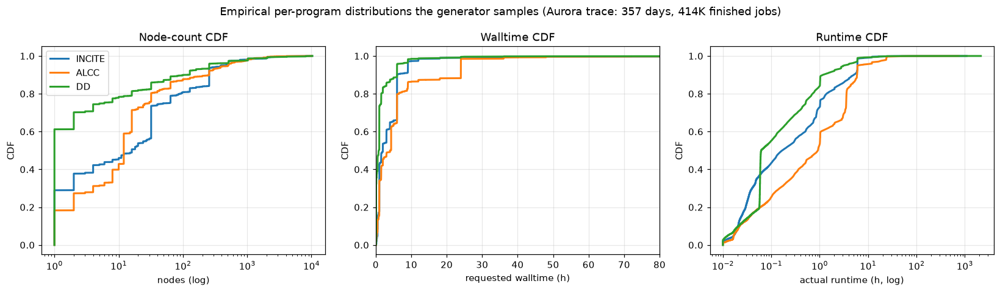
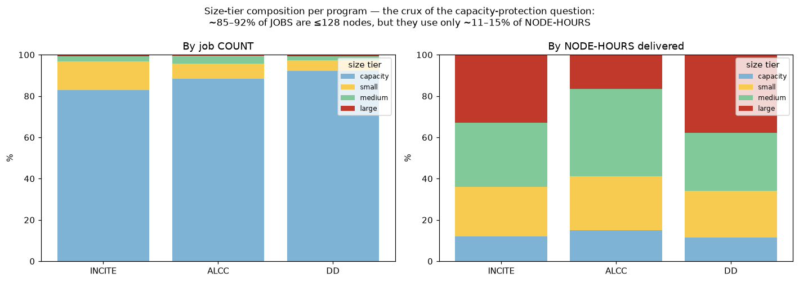
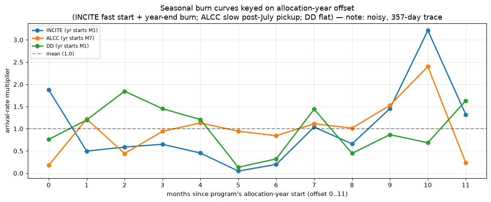
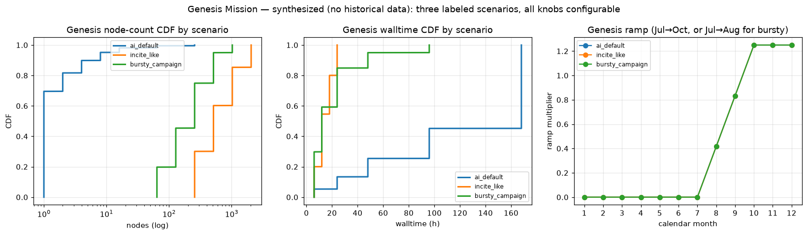

# MODELING.md — How jobs are modeled and sampled

**Purpose.** This document explains exactly how the simulator models the four
allocation programs — **INCITE, ALCC, Discretionary (DD)**, and the new
**Genesis Mission** — so that a reader can understand and challenge every
distribution being sampled and every allocation fraction being assumed. Nothing
here is a black box: for the three historical programs the numbers below are
measured directly from the Aurora PBS trace; for Genesis (which has no history)
every number is a stated assumption with its rationale.

**Data source.** All historical figures come from `pbs_monitor_aurora.db`, table
`jobs`, filtered to `state='FINISHED' AND nodes>0 AND actual_runtime_seconds>=30
AND submit_time IS NOT NULL`, with `allocation_type` mapped
`Discretionary→DD`, `UNKNOWN` dropped.

- Rows after filtering: **414,046**
- Trace span: **2025-06-12 → 2026-06-04 (357 days)**

Regenerate every table/figure in this document with:
```bash
python -c "from generator import load_trace; from config import SimConfig; \
  df=load_trace(SimConfig.from_yaml('configs/validate_baseline.yaml')); \
  print(len(df))"
```
(See "Inspecting the distributions yourself" at the end for the full commands.)
All figures in this document are regenerated by
[`scripts/make_modeling_figures.py`](scripts/make_modeling_figures.py):

```bash
python scripts/make_modeling_figures.py   # writes docs/figures/*.png
```



*Node-count, walltime, and runtime cumulative distributions (CDFs) for the three
historical programs — these are exactly the empirical distributions the joint
sampler draws from. Note DD's steep node CDF (its 1-node spike: p50 = 1 node),
INCITE's high job volume, and ALCC's longer walltimes.*

---

## 1. The core idea: joint bootstrap, not parametric fits

The simulator does **not** fit parametric distributions (log-normal, etc.) to
node counts and walltimes and then sample them independently. That approach
destroys the correlation between a job's size and its duration (e.g. big jobs
tend to run shorter because of walltime caps; 1-node jobs are often long AI
runs).

Instead it uses a **joint conditional bootstrap**: it resamples *whole real
job rows* — the tuple `(nodes, walltime, runtime)` kept together — from the
historical trace, drawn from a cell conditioned on:

```
(program, alloc_month_offset, size_tier)
```

- **program** — INCITE / ALCC / DD (the primary axis; see §6 for why project is
  deliberately excluded for now).
- **alloc_month_offset** — months since *that program's own* allocation-year
  start (0–11). This is what makes calendar behavior intrinsic (§4).
- **size_tier** — the node-count band (capacity/small/medium/large) the row
  falls in, so the cell mix reflects the real size profile within that season.

**What a joint draw looks like** (5 real draws from INCITE, alloc-offset 0):

| nodes | walltime (h) | runtime (h) |
|------:|-------------:|------------:|
| 1     | 0.17         | 0.05        |
| 90    | 2.83         | 0.54        |
| 1     | 1.00         | 0.05        |
| 100   | 0.50         | 0.18        |
| 15    | 6.00         | 5.00        |

Each row is a genuine historical job; the size↔duration relationship is
preserved because we never break the tuple apart.

**Fallback for sparse cells.** If a conditioning cell has fewer than
`generator.min_cell_rows` (default 20) real jobs, the sampler falls back to the
program-wide pool so we never bootstrap from a handful of outliers. Cell sizes
are large in practice — e.g. INCITE's biggest cells:

| program | alloc_offset | size_tier | rows |
|---------|-------------:|-----------|-----:|
| INCITE  | 7            | capacity  | 26,979 |
| INCITE  | 9            | capacity  | 16,751 |
| INCITE  | 0            | capacity  | 13,376 |

Code: `generator.ConditionalSampler`.

---

## 2. Per-program empirical summary (measured from the trace)

| Program | Jobs | Node-hours | **Delivered share** | Arrivals/day | rt/wt ratio (mean) |
|---------|-----:|-----------:|--------------------:|-------------:|-------------------:|
| INCITE  | 142,435 | 38.86 M | **57.0 %** | 399.0 | 0.303 |
| DD      | 230,071 | 20.32 M | **29.8 %** | 644.5 | 0.448 |
| ALCC    | 41,540  | 8.98 M  | **13.2 %** | 116.4 | 0.466 |

"Delivered share" = that program's node-hours ÷ total node-hours across the
three programs. **These are the empirical shares the simulator is validated
against** (see README_v2 — the full-year blind run reproduces ≈49.6/35.6/14.8,
with ALCC filling in over its allocation year).

### Node-count profile (nodes per job)

| Program | mean | p50 | p90 | p99 | max | character |
|---------|-----:|----:|----:|----:|----:|-----------|
| INCITE  | 110.8 | 16 | 256 | 2048 | 10,245 | capability-leaning; broad |
| ALCC    | 92.8  | 12 | 256 | 1800 | 10,000 | similar to INCITE, slightly smaller |
| DD      | 87.1  | **1** | 108 | 2048 | 10,350 | bimodal: 1-node spike + occasional huge |

### Walltime / runtime (hours)

| Program | walltime p50 | walltime p90 | runtime mean | runtime p50 |
|---------|-------------:|-------------:|-------------:|------------:|
| INCITE  | 2.00 | 6.05 | 1.31 | 0.17 |
| ALCC    | 4.21 | 24.00 | 2.55 | 0.92 |
| DD      | 0.83 | 6.00 | 0.79 | 0.06 |

Read this as: DD = many short experimental jobs; ALCC = fewer, longer jobs;
INCITE = high volume, moderate length. The `rt/wt ratio` column above is how
much of requested walltime jobs actually use (INCITE requests generously and
finishes early; ALCC/DD run closer to their requests).

### Size-tier mix — by **job count** (%)

| Program | capacity (1–128) | small (129–512) | medium (513–2048) | large (2049+) |
|---------|-----------------:|----------------:|------------------:|--------------:|
| INCITE  | 83.0 | 13.8 | 2.4 | 0.8 |
| ALCC    | 88.5 | 7.3  | 3.8 | 0.4 |
| DD      | 92.3 | 5.1  | 2.0 | 0.6 |

### Size-tier mix — by **node-hours delivered** (%)

| Program | capacity | small | medium | large |
|---------|---------:|------:|-------:|------:|
| INCITE  | 11.9 | 24.2 | 31.0 | 32.9 |
| ALCC    | 15.0 | 26.2 | 42.2 | 16.6 |
| DD      | 11.3 | 22.9 | 27.8 | 37.9 |

This contrast is the crux of the capacity-protection question: ~85–92 % of
*jobs* are ≤128 nodes, but they consume only ~11–15 % of *node-hours*. The
machine's time goes to the (few) big jobs, while the (many) small jobs dominate
scheduling churn — which is why a naive small-job pool cap oversubscribes.



*Left: nearly all jobs are in the capacity tier (≤128 nodes). Right: yet the
node-hours are consumed mostly by medium/large jobs. This inversion is the whole
reason a capacity-protection lever is needed and why sizing it wrong
oversubscribes the small-job pool.*

---

## 3. Arrival process (when jobs show up)

Arrivals are a **non-homogeneous Poisson process, per program**. The base rate
is the program's annual-average arrivals/hour (measured: INCITE 16.6/h, DD
26.8/h, ALCC 4.8/h), modulated by the seasonal burn curve (§4). Inter-arrival
times are drawn `Exponential(1 / rate(t))`, where `rate(t)` uses the burn
multiplier for the current alloc-month-offset.

Code: `generator.JobGenerator.generate`.

---

## 4. Calendar / seasonality (the ALCC-slow / INCITE-fast behavior)

Each program's seasonal demand is fit as a **length-12 multiplier on its
arrival rate**, keyed on **months-since-allocation-year-start**, not calendar
month. INCITE's allocation year starts in January (offset 0 = Jan); ALCC's
starts in July (offset 0 = Jul). Keying on offset makes "ALCC ramps up slowly
after its July start" and "INCITE starts fast in January" *intrinsic program
properties* rather than accidents of where the trace window happens to sit.

Fitted multipliers (mean ≈ 1.0 over active months; offset 0 = program's own
year start):

| Program (yr start) | o0 | o1 | o2 | o3 | o4 | o5 | o6 | o7 | o8 | o9 | o10 | o11 |
|--------------------|---:|---:|---:|---:|---:|---:|---:|---:|---:|---:|----:|----:|
| INCITE (Jan) | 1.87 | 0.50 | 0.59 | 0.65 | 0.45 | 0.05 | 0.20 | 1.04 | 0.66 | 1.46 | 3.21 | 1.32 |
| ALCC (Jul)   | 0.18 | 1.22 | 0.44 | 0.94 | 1.13 | 0.95 | 0.84 | 1.11 | 1.02 | 1.53 | 2.40 | 0.23 |
| DD (Jan)     | 0.76 | 1.20 | 1.85 | 1.45 | 1.21 | 0.13 | 0.32 | 1.44 | 0.45 | 0.87 | 0.69 | 1.63 |

How to read it: INCITE's offset-10 = 3.21 is the **November end-of-allocation
burn** (offset 10 from a January start = November) — the year-end rush before
the December deadline. ALCC's low early offsets (0.18 at its July start, rising
toward its spring) is the **slow-pickup** behavior you described. DD is
comparatively flat with no strong cycle.



*Arrival-rate multiplier vs. months-since-each-program's-own-year-start. INCITE
(blue) starts fast and spikes at its year-end burn; ALCC (orange) starts slow
after July and ramps toward spring; DD (green) is roughly flat. The curves are
noisy because the trace is only 357 days (see limitation below).*

**Honest limitation.** The trace is only 357 days, so each alloc-offset bin has
partial coverage and some multipliers are noisy artifacts rather than clean
seasonality — e.g. INCITE offset-5 = 0.05 and ALCC offset-0 = 0.18 are
single-window observations, not robust annual means. These curves capture the
*shape* (fast vs slow starters, year-end burn) but should not be over-read at
the individual-month level. With more than one full allocation cycle of data
they would stabilize. The burn curve is a config-adjustable input, so a user
can override it with a smoothed or hypothetical curve.

Code: `generator.fit_burn_curve`.

---

## 5. Allocation fractions & the budget model

### Where the target shares come from

The **delivered** shares above (57/30/13) are what *actually happened* under the
current program-blind policy. The **target** (policy-intent) shares are a
separate, configurable input. The defaults encode the stated ALCF policy intent
and Taylor's decisions:

| Program | Target share (default) | Overburn | Notes |
|---------|-----------------------:|---------:|-------|
| INCITE  | 0.50 | +25 % | may deliver up to 1.25× budget |
| ALCC    | 0.25 | 0 % | |
| DD      | 0.10 | 0 % (soft floor) | never hard-capped when capacity is idle |
| Genesis | 0.15 | 0 % | carved from the others (§7) |

All of these live in `configs/*.yaml` under `programs:` and `genesis:` — no
hard-coded values. The gap between *target* (60/30/10 policy intent) and
*delivered* (57/30/13, and DD historically over-running to ~30 %) is itself a
finding the tool exposes; it is not something the model forces to match.

### Budget model (not fair-share)

Per Taylor's decision, ALCF does **not** enforce fair-share. The model instead
uses **per-program annual node-hour budgets with overburn tolerance**:

- `budget_nh[p] = target_share[p] × total_nodes × 24 × 365`.
- A **pro-rated** budget at time *t* is `budget_nh[p] × (t / year)` — what the
  program "should" have consumed by now if burning evenly.
- Under `policy: budget`, a program's scheduling priority is **damped smoothly**
  as its delivered node-hours exceed its pro-rated budget:
  `budget_damp = exp(-damp_strength × (delivered/prorated − 1))` for ratio > 1,
  else 1.0. Under-users are never penalized.
- A job is **hard-blocked** only if starting it would exceed the *overburn
  ceiling* `budget × (1 + overburn)`. DD is a soft floor and is never
  hard-capped.

`budget_damp`, `budget_ratio`, `delivered_share`, and `target_share` are all
exposed as variables to the configurable score function, so the exact way budget
pressure affects priority is itself tunable from YAML.

Code: `scheduler.Scheduler._damp_factor`, `_over_ceiling`,
`genesis.reallocate_shares`.

---

## 6. Why project is not (yet) a dimension

The DB has a `project` column, and per-project allocation size + burn behavior
is real structure. It is deliberately **excluded for now** (Taylor's call):
program is the dominant axis because the three programs have *different
allocation calendars* that drive different utilization timelines (ALCC slow,
INCITE fast, DD scattered), and that is the first-order effect. The conditioning
schema (`generator.condition_on`) is designed so `project` can be added as a
dimension — or promoted to a first-class entity with its own budget — without a
rewrite. This is noted as future work, not a limitation of the current
question.

---

## 7. Genesis Mission — fully assumption-driven (no historical data)

Genesis has **no trace history**, so it cannot be bootstrapped. It is
synthesized from **explicit, labeled assumptions**, each traceable to Taylor's
stated description (Phase-1: AI-centric, 1-node/7-day dominated, mid-July start
ramping to full by Sept/Oct, ~15 % share). Because it is assumption-driven,
Genesis is modeled as **selectable scenarios** so the sensitivity to those
assumptions can be studied directly.

### The three scenarios (all knobs in `genesis.py` / YAML)

**`ai_default`** — the primary Phase-1 description. Heavily 1-node, ~7-day jobs.

- Node mix (nodes: weight): `1:0.70, 2:0.12, 4:0.08, 8:0.05, 16:0.03, 64:0.015, 256:0.005`
  — rationale: "AI-centric, dominated by 1-node jobs."
- Walltime mix (hours: weight): `168:0.55, 96:0.20, 48:0.12, 24:0.08, 6:0.05`
  — rationale: "~7-day (168 h) dominated."
- Runtime/walltime ratio: `Normal(0.85, 0.12)` clipped to (0.05, 1.0)
  — rationale: "AI jobs run close to the wall."
- Ramp: linear 0 → full over calendar months **July → October**.

**`incite_like`** — a capability-heavy alternative (stress test: what if Genesis
looks like big science instead of AI?).

- Node mix: `256:0.30, 512:0.30, 1024:0.25, 2048:0.15`
- Walltime mix: `6:0.20, 12:0.35, 18:0.25, 24:0.20`; rt/wt `Normal(0.90,0.08)`.

**`bursty_campaign`** — mid-to-large nodes with a compressed July→August surge
(approximates a deadline-driven campaign).

- Node mix: `64:0.20, 128:0.25, 256:0.30, 512:0.20, 1024:0.05`
- Walltime mix: `6:0.30, 12:0.30, 24:0.25, 48:0.10, 96:0.05`; ramp full by August.

### How the Genesis arrival rate is derived (not guessed)

The arrival rate is **derived from the target share**, so Genesis delivers
approximately its allocated fraction rather than an arbitrary job count:

```
annual_target_nh = share × total_nodes × 24 × 365
mean_nh_per_job  = mean(nodes × walltime × rt_ratio) over the synthesized mix
jobs_per_year    = annual_target_nh / mean_nh_per_job
rate (jobs/h)    = jobs_per_year / (hours_in_year × active_fraction_of_year)
```

`active_fraction` accounts for the ramp (Genesis is dormant before July). Result
for a 15 % share on 10,624 nodes:

| Scenario | mean nodes | p50 nodes | mean walltime | mean node-h/job | derived rate |
|----------|-----------:|----------:|--------------:|----------------:|-------------:|
| ai_default      | 4.2   | 1   | 119.9 h | 419.2   | **219.0 jobs/day** |
| incite_like     | 792.6 | 512 | 14.7 h  | 10,448  | **8.8 jobs/day** |
| bursty_campaign | 275.2 | 256 | 20.8 h  | 4,486   | **20.5 jobs/day** |

(Same 15 % share, wildly different job counts, because the mean job size differs
by 25×. This is the point of scenarios: the *share* is fixed policy, the
*character* is the assumption under test.)



*The three synthesized Genesis scenarios. Left/middle: node-count and walltime
CDFs — `ai_default` is tiny-node/long-walltime (AI training), `incite_like` is
big-node/short, `bursty_campaign` is mid-range. Right: the ramp schedules
(Jul→Oct, or the compressed Jul→Aug surge for `bursty_campaign`). None of this
comes from data — it is the explicit assumption set, which is why it is
scenario-selectable.*

### Where Genesis's share comes from (`genesis_from`)

Genesis's 15 % is carved out of the existing programs; the source is a
first-class policy knob:

- `proportional` — taken from INCITE/ALCC/DD in proportion to their base shares.
- `incite` — deducted entirely from INCITE.
- `dd` — deducted entirely from DD.

All four shares are renormalized to sum to 1.0 and printed at run start.

Code: `genesis.build_genesis_arrays`, `genesis_rate_h`, `genesis_burn`,
`reallocate_shares`.

---

## 8. Assumptions & limitations summary

| # | Assumption | Basis | How to test / override |
|---|-----------|-------|------------------------|
| 1 | Historical jobs = joint bootstrap of real rows | Preserves size↔duration correlation | `generator.condition_on` |
| 2 | Burn curves keyed on alloc-year offset | Makes calendar behavior intrinsic | fit is data-driven; can override curve |
| 3 | Burn multipliers noisy (357-day trace) | Partial-year coverage | more data, or supply smoothed curve |
| 4 | Target shares 50/25/10/15 | Taylor's stated policy intent | `programs:` / `genesis.share` in YAML |
| 5 | Budget model w/ INCITE +25 % overburn | Taylor's decision (no fair-share) | `overburn`, `soft_floor`, `damp_strength` |
| 6 | Project not modeled | Taylor's call; program is first-order | schema ready to add |
| 7 | Genesis = AI 1-node/7-day, Jul→Oct ramp | Taylor's Phase-1 description | 3 scenarios + all knobs configurable |
| 8 | Genesis rate derived from share | Ensures ~allocated delivery | `genesis.share`, scenario mix |

---

## Inspecting the distributions yourself

```python
from config import SimConfig
from generator import load_trace, ConditionalSampler, fit_burn_curve
import numpy as np, pandas as pd

cfg = SimConfig.from_yaml("configs/validate_baseline.yaml")
df  = load_trace(cfg)                      # the exact rows the sampler draws from

# per-program node/walltime/runtime percentiles
df.groupby("program")[["nodes","walltime_h","runtime_h"]].describe()

# size-tier mix
pd.crosstab(df["program"], df["size_tier"], normalize="index")

# a program's fitted burn curve
inc = [p for p in cfg.programs if p.name=="INCITE"][0]
fit_burn_curve(df, inc)

# draw joint jobs from a specific cell
cs = ConditionalSampler(df, inc, cfg.generator.min_cell_rows)
[cs.sample_row(0, np.random.default_rng(i)) for i in range(5)]
```

Genesis:
```python
from genesis import build_genesis_arrays, genesis_rate_h, genesis_burn
from config import GenesisConfig
gc = GenesisConfig(enabled=True, scenario="ai_default", share=0.15)
nodes, wt, rt = build_genesis_arrays(gc, np.random.default_rng(0))
genesis_rate_h(gc, 10624, nodes, wt, rt) * 24   # jobs/day
```
