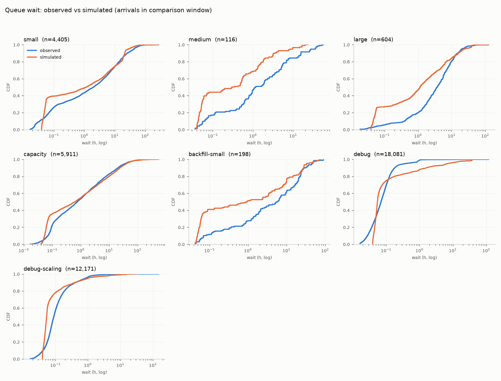
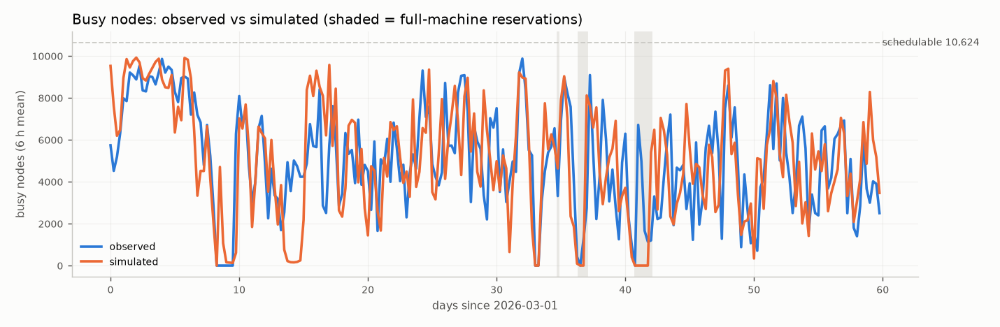
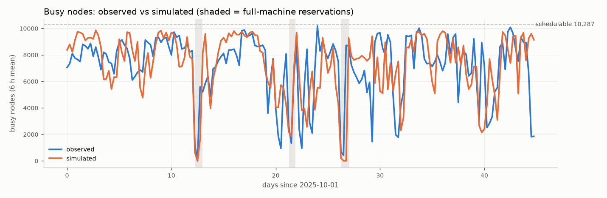

# Replay validation

The real trace (submit times, sizes, walltimes, runtimes, queues, per-job PBS
scoring parameters) is pushed through the simulated scheduler; the only thing
the simulator decides is *when each job starts*. Comparing simulated with
observed waits and busy-node timelines calibrates the scheduler independently
of any workload model.

Run: `python -m schedsim replay --config configs/replay/aurora_2026_spring.yaml`

## What had to be modelled to match reality

Each item below was found by a replay mismatch, then confirmed in the data.

| finding | evidence | model |
|---|---|---|
| Requeued jobs have unreliable spans | jobs with `run_count > 1` produce 26k "running" nodes on a 10.6k machine; dropping them removes 97% of over-capacity time | excluded from replay; their node-hour share is reported |
| Usable nodes vary 6k-10.5k week to week | `node_snapshots` letters decoded against the `nodes` table: E job-exclusive, A free, L reservation, others down/offline | `Machine` uses the up-node series (E+A), gap-aware (monitor has 2-4 day gaps), floored at observed concurrency |
| Maintenance and user reservations remove nodes ahead of time | `reservations` table (`pm` rows are full-machine) | explicit windows in the availability profile so the scheduler drains |
| PBS cycles are event-driven with a latency floor | debug-queue median wait 4 min at 20% load; simulated 8 min with 10-min cycles | passes on arrival/finish, cycle time ~1 s per job examined, 2.5 min dispatch latency, in-cycle rank offset |
| Prod queues run in strict priority order | 30% of small-queue jobs waited >1 h with enough free nodes; queues carry `enable_backfill` 0 (prod) / 1 (backfill-*) | `ordering: strict_groups` = PBS strict_ordering with `backfill_depth` reservations inside the small/medium/large family |
| Dependencies and holds delay eligibility | 15% of prod jobs carry `depend`; small-queue median wait from `etime` is 1.2 h vs 1.9 h from submit | arrival = `etime`; waits still measured from submit |
| The sort formula is quadratic, size-linear, priority-multiplicative, walltime clamped 6-12 h | fitted on recorded `job_history.score`, then confirmed by the server's `job_sort_formula` (see PRIORITY.md) | `ALCF_EXACT` default |
| Debug runs on dedicated shared nodes | debug never exceeded 56 running nodes; real debug waits are unaffected by machine load | 64-node partition |
| Users pace submissions under `max_queued` | per-project queued+running never exceeds 10-11 in the trace | replay does not re-apply the holdback (`enforce_queued_limits: false`); synthetic workloads must |

## Spring 2026 (menu with `capacity`; node snapshots available)

Window 2026-03-01 to 2026-04-30, 53,518 jobs, warm-up 3 days, 48 h cooldown.

| queue | n | obs p50 | sim p50 | obs p90 | sim p90 | obs mean | sim mean | KS |
|---|---:|---:|---:|---:|---:|---:|---:|---:|
| small | 4,405 | 2.02 | 1.52 | 25.9 | 21.6 | 9.04 | 8.15 | 0.19 |
| medium | 116 | 1.41 | 0.48 | 15.6 | 5.1 | 6.17 | 1.80 | 0.32 |
| large | 604 | 3.78 | 1.57 | 15.2 | 16.2 | 6.67 | 5.73 | 0.25 |
| capacity | 5,911 | 0.76 | 0.70 | 20.5 | 27.5 | 7.43 | 8.97 | 0.19 |
| backfill-small | 198 | 5.89 | 0.77 | 31.1 | 27.9 | 12.4 | 10.3 | 0.31 |
| debug | 18,081 | 0.07 | 0.06 | 0.18 | 1.76 | 0.16 | 1.74 | 0.23 |
| debug-scaling | 12,171 | 0.09 | 0.05 | 0.42 | 0.41 | 0.27 | 0.37 | 0.39 |

Utilisation vs 9,600 reportable nodes: observed 51.2%, simulated 50.8%.
Formula ranking by fit (KS + |log2 mean ratio| over menu queues):
`alcf_fitted` 1.19 ~ `alcf_exact` 1.22 < `fifo` 1.31 (the two ALCF forms are
identical for walltimes <= 6 h, which is most jobs).

**Backfill depth.** The server sets `backfill_depth = 10`, but replaying with 10
reservations per pass under our strict-ordering semantics makes the prod
queues far too optimistic (small mean 5.5 h, large 3.0 h vs 9.0 / 6.7 observed),
while depth 1 gives 7.5 / 5.3. ALCF's scheduler hook is evidently stricter than
"backfill freely around the top ten"; depth 1 remains the calibrated default
until the hook's rule is known.

## Fall 2025 (old menu with `tiny`; no node snapshots)

Window 2025-10-01 to 2025-11-15. Utilisation observed 74.1%, simulated 74.5%,
but waits do not match: simulated large-job waits are far too short (median
2.9 h vs 30.6 h) and tiny-job waits too long. Without node-state snapshots the
machine is assumed to have ~9,660 usable nodes throughout; with the real
(unknown) outages a 9,000-node job cannot assemble for days while small jobs
flow. Treat pre-December-2025 windows as qualitative only.

## Known limitations

* **Closed-loop submitters.** Workflow users submit the next job when the
  previous one finishes (visible as per-user run-limit chains in debug and
  per-project chains in tiny/small). A replay keeps their recorded submit
  times, so any latency difference accumulates along the chain. This is why
  simulated debug p90 is 1.8 h against 0.18 h observed, and why the load-
  dependent cycle time cannot be pushed harder without a runaway. The stage-2
  workload model should generate these users as closed loops.
* **Immediate-start spread.** Real waits for jobs that start "immediately" are
  spread over 2-15 min (variable PBS cycle length); the model concentrates them
  near 2.5-4 min. Tails and means, which drive utilisation, are unaffected.
* **Medium queue** is over-served in the sim (mean 1.8 h vs 6.2 h, n=116);
  likely the same strictness applies more tightly than modelled.
* Out-of-model: admin holds, `score_boost` changes mid-window, jobs deleted
  before running (absent from a FINISHED-only trace), non-exclusive placement
  beyond debug, filesystem outages that stop dispatch with nodes free.

## Calibrated defaults (`SchedulerSpec`)

`ordering=strict_groups`, `backfill_depth=1`, `min_pass_gap_h=1/60`,
`pass_time_per_job_h=1/3600`, `max_pass_time_h=5/60`, `dispatch_latency_h=0.04`,
`partitions=(debug: 64 nodes)`, `enforce_queued_limits=False` (replay).
