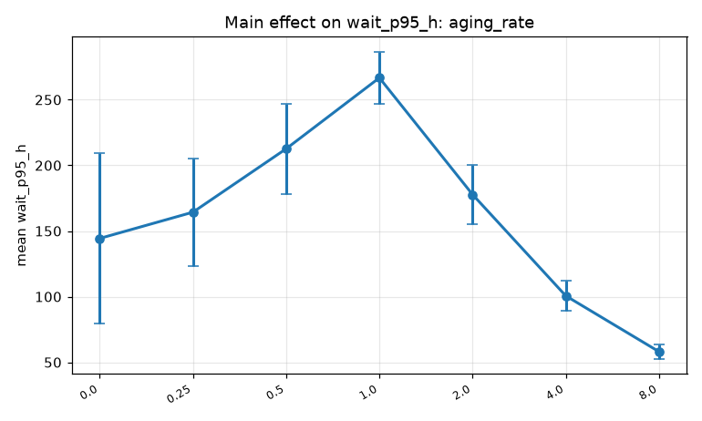
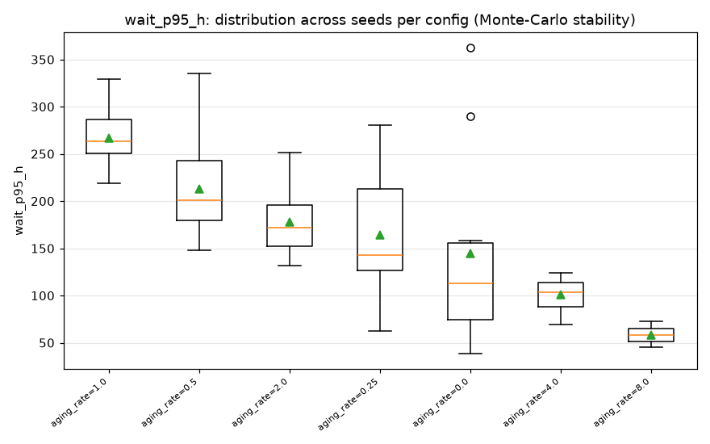
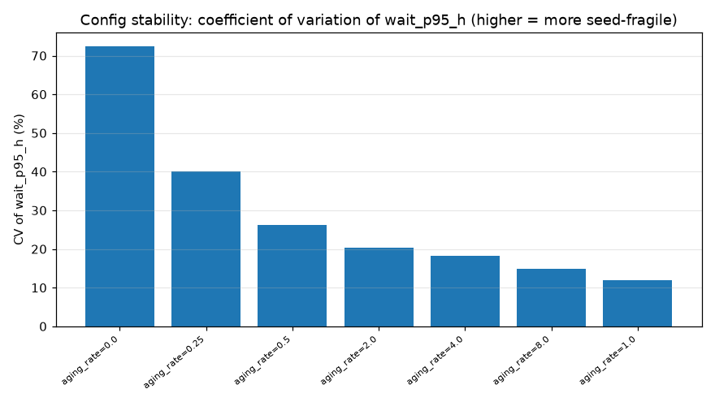

# sched-sim-lator — parameter sensitivity study log

Monte-Carlo studies of how individual scheduling configurables affect the Aurora
queue simulation. Each study varies **one** parameter across a range, holds
everything else fixed, and runs **N seeds per value** so we can report both the
*effect* (mean ± 95% CI) and the *stability* (percentile spread, CV) — a proper
Monte-Carlo treatment rather than single-seed point estimates.

**Method.** Configs generated by `scan.py` (one task per `config × seed`), run on
Crux `parton` (128 cores), reduced by `analyze_scan.py` (per-config mean / 95% CI
/ std / CV / p5–p95 across seeds) → box plots, main-effect curves, CV/stability
bars, tornado. Figures for each study live under `docs/reports/figures/<study>/`;
full per-config stats in each study's `config_stats.csv`.

**Baseline (unless noted):** full year (365 d), 9 600 production nodes, current
4-tier menu (capacity/small/medium/large), FIFO+aging score
(`base + aging_rate*wait`), `budget` policy, `easy` backfill, projects on
(over-alloc 1.15×), Genesis off, load 1.0× historical. Config:
`configs/baseline_fullyear.yaml`.

---

## Study 1 — capacity-tier `aging_rate`

**Question:** how does the aging rate applied to capacity-queue (1–128 node) jobs
affect utilization, queue wait, and node-hour delivery?

**Design:** `size_tiers.capacity.aging_rate ∈ {0.0, 0.25, 0.5, 1.0, 2.0, 4.0,
8.0}` (default 0.5), everything else fixed. 7 values × 10 seeds = 70 full-year
runs. Spec: `experiments/capacity_aging_sweep.yaml`.

### Findings

**It's a wait-time lever, NOT a node-hour-delivery lever.**

1. **Node-hour delivery is flat.** Across the full 0→8 range, delivered
   node-hours to every program move less than their own seed-to-seed noise
   (INCITE 31.41 M → 31.58 M, ≈0.5 %, vs ±0.66 M std; ALCC/DD within ≈0.3 %).
   Utilization is flat at ~70 % (demand-bound). So this knob does **not** steer
   how the machine's time is allocated to programs — a clean negative result.

2. **Overall queue wait responds strongly and NON-monotonically:**

   | capacity aging_rate | wait p95 mean (h) | 95% CI | CV | p5–p95 (h) |
   |--------------------:|------------------:|-------:|----:|-----------:|
   | 0.0                 | 144               | ±65    | **0.72** | 52–330 |
   | 0.25                | 164               | ±41    | 0.40 | 88–261 |
   | 0.5 (default)       | 213               | ±34    | 0.26 | 153–299 |
   | 1.0                 | **267 (worst)**   | ±20    | 0.12 | 225–313 |
   | 2.0                 | 178               | ±23    | 0.20 | 135–232 |
   | 4.0                 | 101               | ±11    | 0.18 | 74–123 |
   | **8.0**             | **58 (best)**     | ±5     | 0.15 | 48–70 |

   Wait **peaks around aging_rate ≈ 1.0, then falls sharply** to a minimum at
   8.0 — an inverted hump. Higher aging gives lower *and* more stable waits.

3. **Stability is itself a finding.** At aging_rate = 0.0 the wait CV is **72 %**
   (p5–p95 = 52–330 h) — a single-seed run there would have been almost
   meaningless. The 10-seed ensemble is what makes this visible. Stability
   improves monotonically as aging rises (CV 0.72 → 0.15).

### Interpretation & caveat

Raising capacity aging accelerates how fast capacity jobs climb over their (low)
base priority, changing *which* jobs wait. The p95 drop at high aging likely
reflects redistribution of wait (capacity jobs cleared faster) more than a
reduction in *total* system wait — this is an overall p95, not per-queue. A
follow-up breaking wait down per queue (capacity vs small/medium/large) would
confirm whether high aging helps capacity jobs at the expense of others.

### Figures

Main effect (mean wait p95 ± 95% CI; the inverted-hump shape; CIs tighten as
aging rises):



Per-config stability (distribution of wait p95 across the 10 seeds — low-aging
configs are wide/fragile, high-aging tight):



Config stability (coefficient of variation by aging_rate — fragility falls as
aging rises):



Reproduce:
```bash
python scan.py --spec experiments/capacity_aging_sweep.yaml --cache data/profiles_cache.npz --out results/capacity_aging_sweep
python analyze_scan.py --results results/capacity_aging_sweep/results.parquet --out results/capacity_aging_sweep/analysis --objective wait_p95_h
```

---
