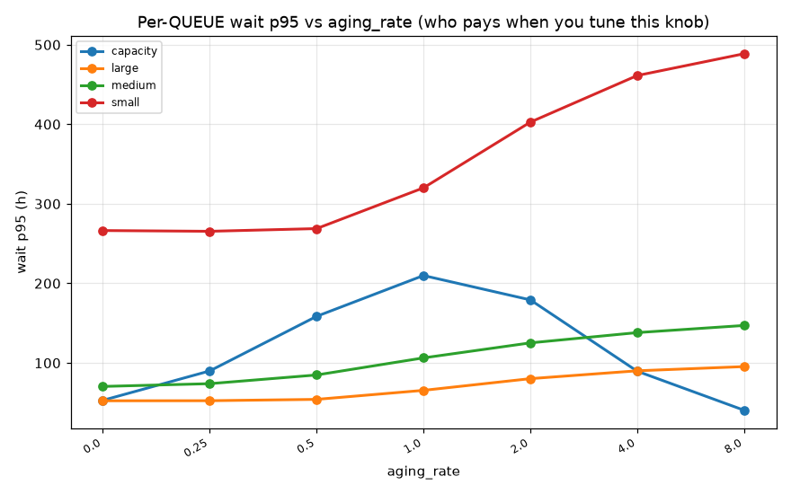
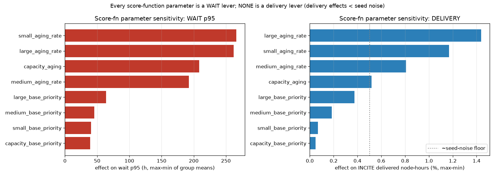
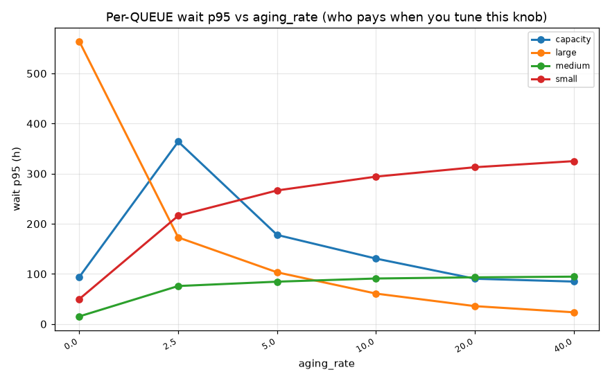

# sched-sim-lator — parameter sensitivity study log

Monte-Carlo studies of how individual scheduling configurables affect the Aurora
queue simulation. Each study varies **one** parameter across a range, holds
everything else fixed, and runs **N seeds per value** so we can report both the
*effect* (mean ± 95% CI) and the *stability* (percentile spread, CV) — a proper
Monte-Carlo treatment rather than single-seed point estimates.

**Method.** Configs generated by `scan.py` (one task per `config × seed`), run on
Crux `parton` (128 cores), reduced by `analyze_scan.py` (per-config mean / 95% CI
/ std / CV / p5–p95 across seeds) → box plots, main-effect curves, CV/stability
bars, tornado. Figures for each study live under `docs/reports/figures/<study>/`;
full per-config stats in each study's `config_stats.csv`.

**Baseline (unless noted):** full year (365 d), 9 600 production nodes, current
4-tier menu (capacity/small/medium/large), FIFO+aging score
(`base + aging_rate*wait`), `budget` policy, `easy` backfill, projects on
(over-alloc 1.15×), Genesis off, load 1.0× historical. Config:
`configs/baseline_fullyear.yaml`.

---

## Study 1 — capacity-tier `aging_rate`

**Question:** how does the aging rate applied to capacity-queue (1–128 node) jobs
affect utilization, queue wait, and node-hour delivery?

**Design:** `size_tiers.capacity.aging_rate ∈ {0.0, 0.25, 0.5, 1.0, 2.0, 4.0,
8.0}` (default 0.5), everything else fixed. 7 values × 10 seeds = 70 full-year
runs. Spec: `experiments/capacity_aging_sweep.yaml`.

### Findings

**It's a wait-time lever, NOT a node-hour-delivery lever.**

1. **Node-hour delivery is flat.** Across the full 0→8 range, delivered
   node-hours to every program move less than their own seed-to-seed noise
   (INCITE 31.41 M → 31.58 M, ≈0.5 %, vs ±0.66 M std; ALCC/DD within ≈0.3 %).
   Utilization is flat at ~70 % (demand-bound). So this knob does **not** steer
   how the machine's time is allocated to programs — a clean negative result.

2. **Overall queue wait responds strongly and NON-monotonically:**

   | capacity aging_rate | wait p95 mean (h) | 95% CI | CV | p5–p95 (h) |
   |--------------------:|------------------:|-------:|----:|-----------:|
   | 0.0                 | 144               | ±65    | **0.72** | 52–330 |
   | 0.25                | 164               | ±41    | 0.40 | 88–261 |
   | 0.5 (default)       | 213               | ±34    | 0.26 | 153–299 |
   | 1.0                 | **267 (worst)**   | ±20    | 0.12 | 225–313 |
   | 2.0                 | 178               | ±23    | 0.20 | 135–232 |
   | 4.0                 | 101               | ±11    | 0.18 | 74–123 |
   | **8.0**             | **58 (best)**     | ±5     | 0.15 | 48–70 |

   Wait **peaks around aging_rate ≈ 1.0, then falls sharply** to a minimum at
   8.0 — an inverted hump. Higher aging gives lower *and* more stable waits.

3. **Stability is itself a finding.** At aging_rate = 0.0 the wait CV is **72 %**
   (p5–p95 = 52–330 h) — a single-seed run there would have been almost
   meaningless. The 10-seed ensemble is what makes this visible. Stability
   improves monotonically as aging rises (CV 0.72 → 0.15).

### Cross-queue analysis (RESOLVES the caveat: who pays?)

The pooled p95 above hid *which* queue pays. Breaking wait down per queue shows
capacity aging is a **"help capacity, hurt everyone else" lever** — the pooled
"aging=8 is best" was misleading because capacity jobs (the huge majority) dominate
the pooled number:

| capacity aging_rate | **capacity** wait | small wait | medium wait | large wait |
|--------------------:|------------------:|-----------:|------------:|-----------:|
| 0.0                 | 53 h              | 266 h      | 70 h        | 52 h       |
| 1.0                 | ~209 h (peak)     | ~265 h     | ~90 h       | ~70 h      |
| 8.0                 | **40 h (best)**   | **489 h**  | **147 h**   | **95 h**   |

Pushing capacity aging from 0 → 8 nearly halves capacity wait (53→40 h) but
**doubles small (266→489 h), doubles medium (70→147 h), and nearly doubles large
(52→95 h).** Throughput is essentially unchanged in every queue (large stays
~7.7 jobs/day throughout), so this redistributes *wait-priority*, not delivery.

**Practical read:** `aging_rate = 0.0` (no capacity aging) is actually the
best-balanced point — every queue's wait is low. Raising capacity aging past ~1.0
progressively sacrifices small/medium/large to shave capacity's wait. The
"lowest pooled wait at 8.0" is a mirage created by capacity's job-count weight.



### Stability note

At aging_rate = 0.0 the pooled wait CV is **72 %** (p5–p95 = 52–330 h) — a
single-seed run there would have been almost meaningless. The 10-seed ensemble is
what makes this visible; stability improves as aging rises (CV 0.72 → 0.15).

### Figures

Pooled main effect (mean wait p95 ± 95% CI; the inverted-hump shape):


Per-config stability (distribution of pooled wait p95 across the 10 seeds):


Config stability (coefficient of variation by aging_rate — fragility falls as
aging rises):


Reproduce:
```bash
python scan.py --spec experiments/capacity_aging_sweep.yaml --cache data/profiles_cache.npz --out results/capacity_aging_sweep
python analyze_scan.py --results results/capacity_aging_sweep/results.parquet --out results/capacity_aging_sweep/analysis --objective wait_p95_h
```

---

## Studies 2–8 — all remaining score-function parameters

**Design:** one MC sweep per parameter, 6 values × 10 seeds, full year, everything
else fixed. Parameters: `base_priority` for all four tiers, and `aging_rate` for
small/medium/large (capacity `aging_rate` = Study 1). Specs:
`experiments/<tier>_<param>_sweep.yaml`. 420 full-year runs total on Crux `parton`.

### Cross-study headline

**Every score-function parameter is a WAIT-TIME lever; NONE is a node-hour
DELIVERY lever.** This held across all 8 parameters without exception:

- **Node-hour delivery to programs is flat** — the max−min effect on INCITE
  delivered node-hours ranged **0.05 %–1.44 %** across every knob, at or below
  the seed-noise floor (~0.5 %). No score parameter meaningfully changes *what
  gets delivered to whom*.
- **Utilization is flat** — spreads of 0.2–0.9 percentage points everywhere
  (the system is demand-bound at 1.0× historical load).
- **Wait time moves a lot, and `aging_rate` dominates `base_priority`:**

  | parameter | effect on wait p95 (max−min, h) | effect on INCITE delivery |
  |-----------|-------------------------------:|--------------------------:|
  | small_aging_rate   | 266 | 1.17 % |
  | large_aging_rate   | 262 | 1.44 % |
  | capacity_aging_rate| 209 | 0.52 % |
  | medium_aging_rate  | 192 | 0.81 % |
  | large_base_priority   | 64 | 0.38 % |
  | medium_base_priority  | 45 | 0.18 % |
  | small_base_priority   | 41 | 0.07 % |
  | capacity_base_priority| 39 | 0.05 % |

  **aging_rate knobs move wait 4–6× more than base_priority knobs.**



### The committee-ready conclusion

At the historical demand level, **score-function tuning redistributes *when jobs
wait*, but cannot change *how the machine's node-hours are allocated to
programs*.** Allocation delivery is set by demand + capacity (and, where enabled,
budget/reservation policy), not by priority scoring. **If the goal is to steer
node-hour delivery, the score function is the wrong lever** — reach for budget
policy, capacity protection, the queue menu (walltime caps), or the load regime.
The score function *is* the right lever for **wait-time / fairness** tuning, where
`aging_rate` is the strong control and `base_priority` a weak one.

### Per-parameter notes

- **`aging_rate` (all tiers)** — strong, **non-monotonic** effect on *pooled*
  wait, same inverted-hump shape as Study 1. But the per-queue view (below) is
  the real story.
- **`base_priority` (all tiers)** — weak effect on pooled wait (≤64 h span); the
  per-queue effect is a gentler version of the aging pattern.

### Cross-queue analysis — the "self-help, others-pay" pattern (the key finding)

Breaking wait down per queue reveals a clean, consistent mechanism across **every
tier's aging_rate**: **raising a tier's aging_rate sharply reduces THAT queue's
wait while raising the wait of the OTHER queues.** It's a zero-sum reallocation of
wait-priority, at ~no change to throughput or delivery.

| knob (0 → max) | its own queue's wait | the other queues' wait |
|----------------|---------------------:|:-----------------------|
| capacity_aging (0→8) | 53 → 40 h ↓ | small 266→489, medium 70→147, large 52→95 ↑↑ |
| small_aging (0→8)    | **850 → 114 h ↓↓** | capacity 23→146, medium 14→136, large 17→95 ↑↑ |
| medium_aging (0→20)  | **251 → 30 h ↓↓** | small 27→321, large 13→75 ↑↑ |
| large_aging (0→40)   | **564 → 23 h ↓↓**  | small 50→325, medium 15→95 ↑↑ |

`base_priority` shows the same self-help direction but far weaker (e.g.
large_base 20→640: large 58→17 h, others rise only mildly). **Throughput per queue
is essentially flat across all knobs** (large stays ~7.7 jobs/day everywhere) — so
these are wait-*reordering* levers, not throughput/delivery levers.

Example (large_aging — large-queue wait collapses 564→23 h while small/medium
climb):



**Design implication:** you cannot lower one queue's wait via its aging_rate
without raising others'. The score function reallocates a fixed wait "budget"
across queues; it does not reduce total contention (that's demand/capacity). At
the historical demand level, note that **aging_rate = 0 (no aging) is often the
most balanced setting** — nonzero aging on any single tier is what creates the
cross-queue penalty. Choosing aging rates is therefore an explicit *fairness
priority* decision among queues, not a free win.

Reproduce (example): `python scan.py --spec experiments/small_aging_rate_sweep.yaml
--cache data/profiles_cache.npz --out results/small_aging_rate_sweep` then
`analyze_scan.py --objective wait_p95_h`. Per-study main-effect, box, and
cross-queue plots under `docs/reports/figures/<study>/`.

---
